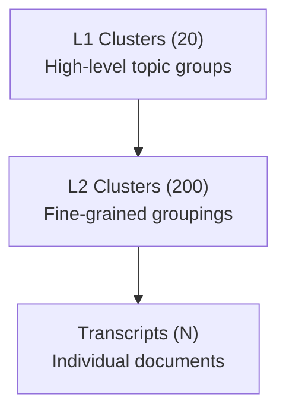

# Hierarchical Clustering Module


## Overview

This module performs **two-level hierarchical clustering** on processed transcripts to organize them into semantically meaningful groups. It combines:

- **OpenAI Embeddings** for semantic representation
- **Agglomerative Clustering** for grouping
- **Groq LLM** for human-readable cluster labeling

### Clustering Hierarchy



---

## Files

| File | Description |
|------|-------------|
| `Clustering.py` | Main clustering pipeline |
| `clustered_transcripts.json` | **Output:** Cluster assignments and embeddings (~42MB) |

---

## Algorithm Pipeline

```
1. Load Corpus
      ↓
2. Extract Text Fields (keywords, reason_for_call)
      ↓
3. Generate OpenAI Embeddings (text-embedding-3-small)
      ↓
4. Agglomerative Clustering → L2 Clusters (200)
      ↓
5. MMR Selection → Representative Samples per Cluster
      ↓
6. LLM Labeling → Name & Description for Each Cluster
      ↓
7. Embed Cluster Labels (name + description)
      ↓
8. Combine Embeddings (centroid + name + desc)
      ↓
9. Agglomerative Clustering → L1 Clusters (20)
      ↓
10. Save Output
```

---

## Configuration

Edit `Clustering.py`:

```python
# Input/Output
INPUT_FILE = "Corpus/corpus.json"
OUT_DIR = "Clusters/"

# Embedding Settings
EMBED_MODEL = "text-embedding-3-small"
EMBED_BATCH = 1000

# Clustering Parameters
NUM_L2 = 200          # Number of fine-grained clusters
NUM_L1 = 20           # Number of high-level clusters

# MMR Selection
MMR_TOP_K = 20        # Representative samples per cluster
MMR_LAMBDA = 0.6      # Diversity vs relevance trade-off

# Embedding Weights
WEIGHT = {
    "centroid": 1.0,  # Document centroid weight
    "name": 0.5,      # Cluster name embedding weight
    "desc": 0.5       # Cluster description embedding weight
}

# API Keys (add your Groq keys)
API_KEYS = ["gsk_...", "gsk_...", ...]  # Multiple keys for rate limiting
LLM_CONCURRENCY = 7
LLM_BATCH = 30
```

---

## Usage

### Prerequisites
```bash
pip install -r requirements.txt

# Set OpenAI API key
export OPENAI_API_KEY=sk-...
```

### Run Clustering
```bash
python Clustering.py
```

### Expected Output
```
Loaded 50000 records.
Embedding 50000... [████████████████] 100%
L2 Clustering complete: 200 clusters
Labeling L2 clusters... [████████████████] 100%
L1 Clustering complete: 20 clusters
Saved clusters_keywords.json
Saved embeddings_keywords.json
Done in 1847.23s
```

---

## Output Schema

### L1 Cluster
```json
{
  "type": "L1Cluster",
  "field": "keywords",
  "id": "keywords_L1_5",
  "name": "Billing and Payment Issues",
  "description": "Clusters related to payment disputes and billing inquiries",
  "embedding": [0.023, -0.045, ...],
  "child_count": 12
}
```

### L2 Cluster
```json
{
  "type": "L2Cluster",
  "field": "keywords",
  "id": "keywords_L2_42",
  "name": "Credit Card Payment Failures",
  "description": "Issues with credit card transactions not processing",
  "embedding": [0.018, -0.032, ...],
  "parent_id": "keywords_L1_5",
  "member_ids": ["T001", "T002", "T003", ...]
}
```

---

## Performance

| Metric | Value |
|--------|-------|
| Corpus Size | ~50,000 transcripts |
| Processing Time | ~30-40 minutes |
| L2 Clusters | 200 |
| L1 Clusters | 20 |
| Embedding Model | `text-embedding-3-small` |
| LLM Model | `openai/gpt-oss-120b` (via Groq) |

---

## License

This project is provided as-is for educational and research purposes.
