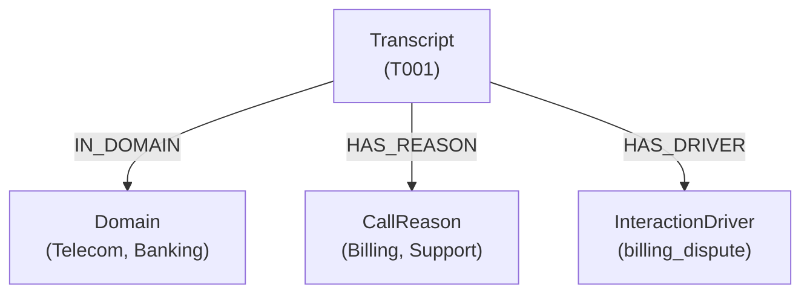

# Knowledge Graph Generation Module


## Overview

This module constructs and queries a **Neo4j Knowledge Graph** from processed transcripts. It enables:

- **Graph-based retrieval** using Personalized PageRank (PPR)
- **Intent-aware filtering** based on query classification
- **Domain masking** for targeted search
- **Hierarchical cluster integration** for hybrid retrieval

---

## Files

| File | Description |
|------|-------------|
| `Graph_Generation.py` | Neo4j graph construction and PPR querying |
| `Hierarcical_Retriver.py` | Cluster-based hierarchical retrieval |

---

## Graph Schema



### Node Types

| Node | Properties |
|------|------------|
| `Transcript` | `id` |
| `Domain` | `name` (Telecom, Banking, Insurance, etc.) |
| `CallReason` | `name` (Billing Inquiry, Technical Support, etc.) |
| `InteractionDriver` | `name` (billing_dispute, network_issues, etc.) |

### Relationships

| Relationship | Description |
|--------------|-------------|
| `IN_DOMAIN` | Transcript → Domain |
| `HAS_REASON` | Transcript → CallReason |
| `HAS_DRIVER` | Transcript → InteractionDriver |

---

## Configuration

Edit `Graph_Generation.py`:

```python
# Neo4j Connection
NEO4J_URI = "bolt://your-neo4j-host:7687"
NEO4J_USER = "neo4j"
NEO4J_PASSWORD = "your-password"

# Data Files
DATA_FILE = "Corpus/corpus.json"
CLUSTERINGS_FILE = "Clusters/clustered_transcripts.json"

# Domain Filters
DOMAIN_INTENTS = {
    "flight_domain", "insurance_domain", "hotel_domain",
    "retail_domain", "banking_domain", "telecom_domain"
}
```

---

## Usage

### Prerequisites
```bash
pip install -r requirements.txt

# Configure environment
export NEO4J_URI=bolt://localhost:7687
export NEO4J_USER=neo4j
export NEO4J_PASSWORD=your-password
```

### Load Graph Data
```python
from Graph_Generation import Neo4jGraphRAG

rag = Neo4jGraphRAG(NEO4J_URI, NEO4J_USER, NEO4J_PASSWORD)

# Clear existing data (optional)
rag.clear_database()

# Load transcripts into graph
rag.load_graph()

# Close connection
rag.close()
```

### Query the Graph
```python
rag = Neo4jGraphRAG(NEO4J_URI, NEO4J_USER, NEO4J_PASSWORD)

query = "Why do customers complain about billing in telecom?"
results = rag.query(query, top_k=10)

for r in results:
    print(f"Rank {r['rank']}: {r['transcript_id']}")
    print(f"  Domain: {r['domain']}")
    print(f"  Drivers: {r['drivers']}")
    print(f"  PPR Score: {r['ppr_score']}")

rag.close()
```

---

## Query Processing Flow

```
1. User Query
      ↓
2. Intent Classification → Extract drivers + domains
      ↓
3. Domain Masking → Filter to relevant domains
      ↓
4. Hierarchical Retrieval → Get candidate transcript IDs
      ↓
5. Graph Subgraph Extraction → Build local graph
      ↓
6. Personalized PageRank → Score transcripts
      ↓
7. Return Top-K Results
```

### Example Query Output
```
====================================
QUERY: Why do customers complain about billing?
IDENTIFIED DRIVERS: ['billing_dispute', 'telecom_domain']
DOMAIN MASKING: ON → Telecom
====================================

Unmasked transcripts: 2547
Seeds (max overlap 3): 45
Subgraph: 1823 nodes, 4521 edges

TOP 10 RESULTS
====================================
RANK 1 | PPR: 0.002341
ID     : T12345
Domain : Telecom
Reason : Billing Inquiry
Drivers: billing_dispute, payment_issues
Preview: Agent: How can I help... | Customer: I'm calling about...
```

---

## Output Schema

```json
{
  "rank": 1,
  "transcript_id": "T12345",
  "ppr_score": 0.002341,
  "domain": "Telecom",
  "call_intent": "Billing Inquiry",
  "drivers": ["billing_dispute", "payment_issues"],
  "driver_overlap": 3,
  "preview": "Agent: How can I help... | Customer: ..."
}
```

---

## Performance

| Metric | Value |
|--------|-------|
| Graph Load Time | ~2 minutes (50K transcripts) |
| Query Time | ~0.5-2 seconds |
| Batch Size | 500 transcripts/batch |
| PPR Parameters | alpha=0.85, max_iter=100 |

---

## License

This project is provided as-is for educational and research purposes.
