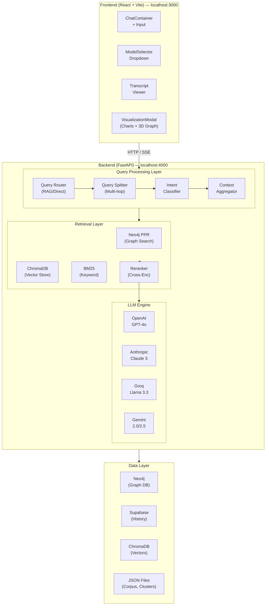

# CausalFlux Pipeline — Backend & Frontend


---

## Overview

The **CausalFlux Pipeline** is a production-ready RAG (Retrieval-Augmented Generation) system with a dual-container microservices architecture. It processes customer service transcripts using advanced Graph RAG and Vector RAG techniques for causality-aware question answering.

### Key Features

| Feature | Description |
|---------|-------------|
| **Multi-Model LLM** | Switch between GPT-4o, Claude 3, Llama 3.3, and Gemini 2.0 |
| **Smart Query Routing** | Automatic intent classification for optimal retrieval strategy |
| **Graph + Vector RAG** | Hybrid search combining Neo4j PPR with ChromaDB/BM25 |
| **3D Visualization** | Interactive knowledge graph with Three.js |
| **Real-time Streaming** | Server-Sent Events for live response streaming |
| **Chat History** | Supabase-backed conversation persistence |

---

## System Architecture



---

## Folder Structure

```
Pipeline/
│
├── backend/                           # FastAPI Backend Service
│   ├── CausalFlux.py                  # Main application entry point
│   ├── Dockerfile                     # Backend container config
│   ├── requirements.txt               # Python dependencies
│   ├── .env                           # Environment variables
│   ├── final_dataset.json             # Processed transcript corpus (~270MB)
│   │
│   ├── LLM/                           # Multi-Provider LLM Integration
│   │   ├── model.py                   # Unified LLM wrapper (OpenAI/Anthropic/Groq/Gemini)
│   │   ├── caching.py                 # Supabase chat history management
│   │   └── sysprompt.txt              # System prompt for responses
│   │
│   ├── Rags_and_Graphs/               # Retrieval Implementations
│   │   ├── build_graph.py             # CLUSTER_PPR - Neo4j PageRank retrieval
│   │   ├── Hierarcical_Retriver.py    # L1/L2 cluster-based retrieval
│   │   ├── reranker.py                # Cross-encoder reranking
│   │   ├── clusters.py                # Cluster utilities
│   │   └── clustered_transcripts.json # Cluster mappings
│   │
│   ├── Rephraser/                     # Query Processing
│   │   ├── query_router.py            # RAG vs Direct LLM decision
│   │   ├── sub_query_router.py        # Multi-hop query handling
│   │   ├── splitter.py                # Complex query decomposition
│   │   └── intent_identifier.py       # Driver/intent classification
│   │
│   └── Plots/                         # Visualization Generation
│       ├── plot_generator.py           # Base64 chart generation
│       ├── bubbles.py                  # Bubble chart logic
│       ├── intents_plots.py            # Intent distribution
│       ├── nested_pie.py               # Nested pie charts
│       └── number_intents_plots.py     # Frequency charts
│
├── src/                               # React Frontend Source
│   ├── App.tsx                        # Main React application
│   ├── main.tsx                       # Entry point
│   ├── index.css                      # Global styles
│   │
│   ├── components/                    # UI Components
│   │   ├── ChatContainer.tsx          # Main chat interface container
│   │   ├── ChatInput.tsx              # Message input with send button
│   │   ├── ChatMessage.tsx            # Message rendering with markdown
│   │   ├── ChatSidebar.tsx            # Conversation history sidebar
│   │   ├── ModelSelector.tsx          # LLM model dropdown
│   │   ├── TranscriptViewer.tsx       # Transcript detail modal
│   │   ├── VisualizationModal.tsx     # Charts display modal
│   │   ├── PixelBlast.tsx             # 3D particle background
│   │   ├── FloatingLines.tsx          # Animated line effects
│   │   ├── DarkVeil.tsx               # Dark overlay component
│   │   └── ui/                        # Shadcn/UI components (49 files)
│   │
│   ├── pages/                         # Route pages
│   ├── hooks/                         # Custom React hooks
│   ├── lib/                           # Utility functions
│   ├── integrations/                  # External service configs
│   └── types/                         # TypeScript type definitions
│
├── public/                            # Static assets
├── docker-compose.yml                 # Main Docker Compose config
├── Dockerfile.frontend                # Frontend multi-stage build
├── nginx.conf                         # Nginx reverse proxy config
├── package.json                       # Frontend dependencies
├── tailwind.config.ts                 # Tailwind CSS configuration
├── vite.config.ts                     # Vite build configuration
└── tsconfig.json                      # TypeScript configuration
```

---

## API Reference

### Base URL
```
http://localhost:4000
```

### Endpoints

#### Health Check
```http
GET /
```
**Response:**
```json
{
  "status": "active",
  "service": "RAG Chatbot Backend"
}
```

---

#### List Available Models
```http
GET /config/models
```
**Response:**
```json
{
  "models": {
    "OpenAI GPT-4o": {"model": "gpt-4o", "provider": "openai"},
    "OpenAI GPT-4o-mini": {"model": "gpt-4o-mini", "provider": "openai"},
    "Claude 3.5 Sonnet": {"model": "claude-3-5-sonnet-20241022", "provider": "anthropic"},
    "Claude 3 Opus": {"model": "claude-3-opus-20240229", "provider": "anthropic"},
    "Claude 3 Haiku": {"model": "claude-3-haiku-20240307", "provider": "anthropic"},
    "Groq Llama 3.3 70B": {"model": "llama-3.3-70b-versatile", "provider": "groq"},
    "Groq Llama 3.1 8B": {"model": "llama-3.1-8b-instant", "provider": "groq"},
    "Gemini 2.5 Pro": {"model": "gemini-2.5-pro", "provider": "gemini"},
    "Gemini 2.0 Flash": {"model": "gemini-2.5-flash", "provider": "gemini"}
  }
}
```

---

#### Chat (Non-Streaming)
```http
POST /chat
Content-Type: application/json
```
**Request Body:**
```json
{
  "message": "What causes customer frustration in telecom calls?",
  "model_choice": "OpenAI GPT-4o-mini",
  "task_mode": "task1"
}
```

| Field | Type | Description |
|-------|------|-------------|
| `message` | string | User's query |
| `model_choice` | string | Key from `/config/models` |
| `task_mode` | string | `"task1"` (no history) or `"task2"` (with history) |

**Response:**
```json
{
  "response": "Based on the retrieved transcripts, customer frustration in telecom...",
  "metadata": {
    "provider": "OPENAI",
    "model": "gpt-4o-mini",
    "route": "RAG",
    "tokens": 2547,
    "source": "CLUSTER_PPR",
    "task_mode": "task1",
    "history_used": false,
    "transcript_ids": ["T001", "T002", "T003"],
    "query_drivers": ["network_issues", "billing_dispute"],
    "query_text": "What causes customer frustration in telecom calls?",
    "execution_time": 3.2451
  }
}
```

---

#### Chat (Streaming)
```http
POST /chat/stream
Content-Type: application/json
```
**Request Body:** Same as `/chat`

**Response:** Server-Sent Events (SSE)
```
data: {"type":"content","text":"Based on"}

data: {"type":"content","text":" the retrieved"}

data: {"type":"content","text":" transcripts..."}

data: {"type":"metadata","metadata":{...}}

data: {"type":"done"}
```

---

#### Get Transcript Details
```http
GET /transcript/{transcript_id}
```
**Response:**
```json
{
  "transcript_id": "T001",
  "domain": "Telecom",
  "intent": "Billing Inquiry",
  "reason_for_call": "Customer questions about charges",
  "turns": [...],
  "metadata": {
    "call_summary": "...",
    "outcome": "Resolved",
    "predefined_interaction_drivers": [...],
    "identified_interaction_drivers": [...]
  }
}
```

---

#### Generate Visualizations
```http
POST /api/visualizations
Content-Type: application/json
```
**Request Body:**
```json
{
  "transcript_ids": ["T001", "T002", "T003"],
  "drivers": [],
  "query_text": "What causes customer frustration?"
}
```

**Response:**
```json
{
  "plots": {
    "intents_bar": "data:image/png;base64,iVBORw0KGgo...",
    "frequency_bar": "data:image/png;base64,iVBORw0KGgo...",
    "cluster_pie": "data:image/png;base64,iVBORw0KGgo...",
    "bubble_chart": "data:image/png;base64,iVBORw0KGgo..."
  },
  "query_intents": ["billing_dispute", "network_issues"],
  "success": true
}
```

---

## Docker Deployment

### Quick Start

```bash
# Navigate to Pipeline folder
cd Pipeline
# Install packages
npm install
# Build and run both services
docker-compose up --build

# Or run in background
docker-compose up --build -d
```

### Access Points

| Service | URL | Description |
|---------|-----|-------------|
| **Frontend** | http://localhost:3000 | Web Interface |
| **Backend API** | http://localhost:4000 | REST API |
| **Swagger Docs** | http://localhost:4000/docs | Interactive API Documentation |
| **ReDoc** | http://localhost:4000/redoc | Alternative API Docs |

### Docker Commands Reference

```bash
# View running containers
docker-compose ps

# View logs
docker-compose logs -f backend
docker-compose logs -f frontend

# Stop services
docker-compose down

# Rebuild specific service
docker-compose up --build backend

# Remove all data (including volumes)
docker-compose down -v
```

### Container Specifications

| Container | Base Image | Port | Resources |
|-----------|------------|------|-----------|
| `flux-backend` | python:3.11-slim | 4000 | ~2GB RAM |
| `flux-frontend` | nginx:alpine | 3000 (->80) | ~50MB RAM |

---

## Environment Configuration

Create `backend/.env` with the following:

```env
# ============================
# Neo4j Database (Required)
# ============================
NEO4J_URI2=bolt://your-host:7687
NEO4J_USER2=neo4j
NEO4J_PASSWORD2=your-password

# ============================
# LLM Providers (At least one)
# ============================
OPENAI_API_KEY=sk-...
ANTHROPIC_API_KEY=sk-ant-...
GROQ_API_KEY=gsk_...
GEMINI_API_KEY=AI...

# ============================
# Supabase (Optional - for chat history)
# ============================
SUPABASE_URL=https://xxx.supabase.co
SUPABASE_KEY=eyJhbGciOiJIUzI1NiIsInR5cCI6IkpXVCJ9...
```

---

## Local Development

### Backend Development

```bash
cd backend

# Create virtual environment
python -m venv venv
venv\Scripts\activate  # Windows
source venv/bin/activate  # Linux/Mac

# Install dependencies
pip install -r requirements.txt

# Run development server
python CausalFlux.py
```

### Frontend Development

```bash
cd Pipeline

# Install dependencies
npm install

# Start dev server with hot reload
npm run dev

# Build for production
npm run build

# Preview production build
npm run preview
```

---

## Testing the API

### Using cURL

```bash
# Health check
curl http://localhost:4000/

# Chat request
curl -X POST http://localhost:4000/chat \
  -H "Content-Type: application/json" \
  -d '{
    "message": "Why do customers call about billing issues?",
    "model_choice": "Groq Llama 3.3 70B",
    "task_mode": "task1"
  }'

# Stream response
curl -X POST http://localhost:4000/chat/stream \
  -H "Content-Type: application/json" \
  -H "Accept: text/event-stream" \
  -d '{
    "message": "Explain network outage complaints",
    "model_choice": "OpenAI GPT-4o-mini",
    "task_mode": "task1"
  }'
```

### Using Python

```python
import requests

# Chat request
response = requests.post(
    "http://localhost:4000/chat",
    json={
        "message": "What are common customer complaints?",
        "model_choice": "OpenAI GPT-4o-mini",
        "task_mode": "task1"
    }
)
print(response.json())
```

---

## Troubleshooting

| Issue | Solution |
|-------|----------|
| **Backend fails to start** | Check `.env` file exists and has valid API keys |
| **Neo4j connection error** | Verify Neo4j URI and credentials are correct |
| **Frontend can't reach backend** | Wait ~60s for backend health check to pass |
| **Out of memory** | Increase Docker memory to 8GB+ |
| **CORS errors** | Backend allows all origins by default |
| **Slow first response** | Dataset loads on first request (~30s) |

### View Container Logs

```bash
# Backend logs
docker logs flux-backend -f

# Frontend logs  
docker logs flux-frontend -f
```

---

## License

This project is provided as-is for educational and research purposes.
