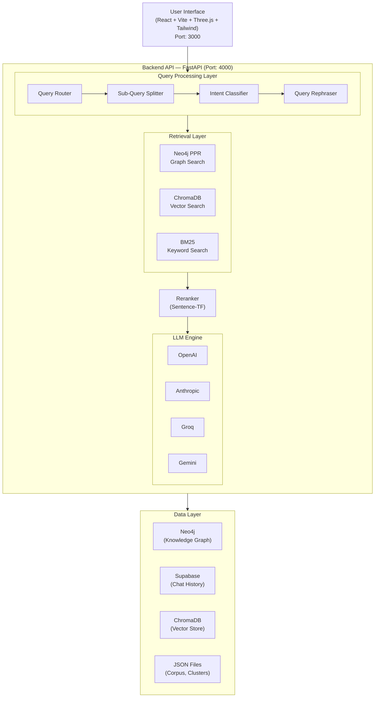

# CausalFlux — Advanced RAG Pipeline for Customer Service Analytics


## Project Overview

**CausalFlux** is a sophisticated **Retrieval-Augmented Generation (RAG) Pipeline** designed for intelligent analysis and querying of customer service call transcripts. This system combines advanced **Graph RAG** and **Vector RAG** techniques to enable causality-aware question answering over large transcript datasets.

### What This Project Does

1. **Corpus Generation**: Processes raw call transcripts using Gemini AI to extract metadata, interaction drivers, sentiment analysis, and call summaries.

2. **Hierarchical Clustering**: Groups transcripts into two-level clusters (L1/L2) using OpenAI embeddings and agglomerative clustering for efficient retrieval.

3. **Knowledge Graph Construction**: Builds a Neo4j graph database with relationships between transcripts, domains, call reasons, and interaction drivers.

4. **Intelligent RAG Pipeline**: 
   - **Query Routing**: Automatically classifies intent to choose the best retrieval strategy
   - **Multi-hop Reasoning**: Handles complex queries requiring multiple sub-queries
   - **Hybrid Search**: Combines Graph Search (Neo4j PPR) + Vector Search (ChromaDB/BM25)
   - **Context-aware Reranking**: Uses sentence transformers for final result optimization

5. **Multi-Model LLM Support**: Seamlessly switch between OpenAI GPT-4o, Claude 3, Llama 3, and Gemini models.

6. **Interactive Web Interface**: Modern React frontend with 3D knowledge graph visualization, real-time streaming responses, and visualization dashboards.

---

## Demo Video

[](https://youtu.be/5CY9jB4rwU4?si=ZJWNmyUdzVaeUA_X)

---

## System Architecture



---

## Core Components

This section provides a concise overview of the key techniques and modules used across the pipeline.

| Component | Description |
|-----------|-------------|
| **Corpus Generation** | Uses Google Gemini to extract structured metadata (domain, intent, call reason, interaction drivers, sentiment scores) from raw call transcripts, transforming unstructured conversations into analysis-ready data. |
| **Hierarchical Clustering** | Employs agglomerative clustering at two levels — 20 high-level (L1) and 200 fine-grained (L2) clusters — over OpenAI embeddings. Cluster labels are generated via LLM. This enables efficient, scope-narrowed retrieval. |
| **MMR (Maximal Marginal Relevance)** | A diversity-aware selection algorithm used during clustering to pick representative transcript samples per cluster. It balances relevance to the cluster centroid with diversity among selected items, controlled by a lambda parameter. |
| **Knowledge Graph** | A Neo4j graph database where nodes represent Transcripts, Domains, Call Reasons, and Interaction Drivers, linked by typed relationships (`IN_DOMAIN`, `HAS_REASON`, `HAS_DRIVER`). Enables structured, relationship-aware retrieval. |
| **PPR (Personalized PageRank)** | A graph traversal algorithm that scores transcript relevance by seeding PageRank from query-matched driver/domain nodes. Transcripts accumulating higher random-walk probability are ranked higher, capturing multi-hop relational context. |
| **RAG Pipeline** | The core retrieval-augmented generation system. Query Routing classifies intent and decides between direct LLM response or retrieval. Retrieval combines Graph Search (PPR), Vector Search (ChromaDB), and Keyword Search (BM25). Results are reranked via cross-encoder before final LLM synthesis. |
| **Evaluation Suite** | Measures pipeline quality across retrieval (Recall, MRR, Hit@K, Cosine Similarity) and generation (BLEU, ROUGE-1/2/L, BERTScore F1). LLM-based metrics score Relevancy, Completeness, and Coherence. |
| **Visualization** | Generates sentiment progression curves, hierarchical bubble charts, intent distribution bar charts, nested pie charts for cluster breakdown, and driver frequency histograms — all rendered as Base64 images for the frontend. |
| **Query Generation** | Scripts that programmatically generate causal reasoning queries (Task 1) and multi-turn follow-up queries (Task 2) for pipeline testing and evaluation. |

---

## Folder Structure

```
CausalFlux/
│
├── Corpus/                            # Data Preprocessing & Corpus Generation
│   ├── Corpus_Generation.py           # Gemini-based transcript processing pipeline
│   ├── system_prompt.txt              # LLM system prompt for metadata extraction
│   ├── Default_corpus.json            # Raw input transcripts
│   └── corpus.json                    # Processed corpus with metadata
│
├── Clusters/                          # Hierarchical Clustering Module
│   ├── Clustering.py                  # L1/L2 agglomerative clustering with labeling
│   └── clustered_transcripts.json     # Cluster assignments and embeddings
│
├── Graph/                             # Knowledge Graph Generation
│   ├── Graph_Generation.py            # Neo4j graph construction & PPR querying
│   └── Hierarcical_Retriver.py        # Hierarchical cluster-based retrieval
│
├── Evaluations/                       # RAG Evaluation Suite
│   ├── Evaluations.py                 # BLEU, ROUGE, BERTScore, LLM-based metrics
│   └── Readme.md                      # Evaluation documentation
│
├── Queries/                           # Query Generation for Testing
│   ├── Query_Generation_Task1.py      # Causal inquiry query generation
│   └── Query_Generation_Task2.py      # Follow-up query generation
│
├── Plots/                             # Visualization Scripts
│   ├── bubbles.py                     # Bubble chart visualizations
│   ├── intents_plots.py               # Intent distribution plots
│   ├── nested_pie.py                  # Nested pie charts
│   └── final_plots.py                 # Combined visualization exports
│
├── Pipeline/                          # Main Application (Docker-Ready)
│   │
│   ├── backend/                       # FastAPI Backend Service
│   │   ├── CausalFlux.py              # Main FastAPI application
│   │   ├── Dockerfile                 # Backend container configuration
│   │   ├── requirements.txt           # Python dependencies
│   │   ├── .env                       # Environment variables (API keys)
│   │   ├── final_dataset.json         # Production dataset
│   │   │
│   │   ├── LLM/                       # LLM Integration
│   │   │   ├── model.py               # Multi-provider LLM wrapper
│   │   │   └── caching.py             # Supabase chat history caching
│   │   │
│   │   ├── Rags_and_Graphs/           # RAG & Graph Retrieval
│   │   │   ├── build_graph.py         # Cluster PPR implementation
│   │   │   ├── reranker.py            # Cross-encoder reranking
│   │   │   ├── clusters.py            # Cluster management utilities
│   │   │   └── Hierarcical_Retriver.py # Hierarchical retrieval logic
│   │   │
│   │   ├── Rephraser/                 # Query Processing
│   │   │   ├── query_router.py        # RAG vs Direct LLM routing
│   │   │   ├── sub_query_router.py    # Multi-hop query handling
│   │   │   ├── splitter.py            # Query decomposition
│   │   │   └── intent_identifier.py   # Intent classification
│   │   │
│   │   └── Plots/                     # Dynamic Visualization Generation
│   │       └── plot_generator.py      # Base64 plot generation for frontend
│   │
│   ├── src/                           # React Frontend Source
│   │   ├── components/                # UI Components (Chat, GraphView, etc.)
│   │   ├── App.tsx                    # Main React application
│   │   └── main.tsx                   # Entry point
│   │
│   ├── public/                        # Static assets
│   ├── docker-compose.yml             # Docker Compose configuration
│   ├── Dockerfile.frontend            # Frontend container configuration
│   ├── nginx.conf                     # Nginx reverse proxy config
│   ├── package.json                   # Frontend dependencies
│   └── README.md                      # Pipeline-specific documentation
│
└── README.md                          # This file
```

---

## Docker Deployment Guide

### Prerequisites

- [Docker Desktop](https://www.docker.com/products/docker-desktop/) installed and running
- At least 8GB RAM available for Docker
- Internet connection for pulling base images

---

### Option 1: Build & Run with Docker Compose (Recommended)

This is the **easiest way** to run the entire application.

#### Step 1: Navigate to the Pipeline Directory

```bash
cd Pipeline
```

#### Step 2: Configure Environment Variables

Create/edit the `backend/.env` file with your API keys:

```env
# Neo4j Database (Required)
NEO4J_URI2=bolt://your-neo4j-host:7687
NEO4J_USER2=neo4j
NEO4J_PASSWORD2=your-password

# LLM Providers (At least one required)
OPENAI_API_KEY=sk-...
ANTHROPIC_API_KEY=sk-ant-...
GROQ_API_KEY=gsk_...
GEMINI_API_KEY=AI...

# Supabase (For chat history - Optional)
SUPABASE_URL=https://your-project.supabase.co
SUPABASE_KEY=your-anon-key
```

#### Step 3: Build and Start All Services

```bash
# Build images and start containers
docker-compose up --build

# Or run in detached mode (background)
docker-compose up --build -d
```

#### Step 4: Access the Application

| Service  | URL                          | Description              |
|----------|------------------------------|--------------------------|
| Frontend | http://localhost:3000        | Web Interface            |
| Backend  | http://localhost:4000        | FastAPI REST API         |
| API Docs | http://localhost:4000/docs   | Swagger UI Documentation |

#### Step 5: Stop the Application

```bash
# Stop and remove containers
docker-compose down

# Stop and remove containers + volumes
docker-compose down -v
```

---

### Option 2: Build Images Separately

#### Build Backend Image

```bash
cd Pipeline/backend
docker build -t causalflux-backend:latest .
```

#### Build Frontend Image

```bash
cd Pipeline
docker build -t causalflux-frontend:latest -f Dockerfile.frontend .
```

#### Run Containers Manually

```bash
# Create network
docker network create flux-network

# Run backend
docker run -d \
  --name flux-backend \
  --network flux-network \
  -p 4000:4000 \
  -v $(pwd)/backend/.env:/app/.env:ro \
  -v $(pwd)/backend/final_dataset.json:/app/final_dataset.json:ro \
  causalflux-backend:latest

# Run frontend
docker run -d \
  --name flux-frontend \
  --network flux-network \
  -p 3000:80 \
  causalflux-frontend:latest
```

---

## Local Development (Without Docker)

### Backend Setup

```bash
# Navigate to backend
cd Pipeline/backend

# Create virtual environment
python -m venv venv

# Activate (Windows)
venv\Scripts\activate

# Activate (Linux/Mac)
source venv/bin/activate

# Install dependencies
pip install -r requirements.txt

# Configure environment
cp .env.example .env
# Edit .env with your API keys

# Run the server
python CausalFlux.py
```

The backend will be available at `http://localhost:4000`

### Frontend Setup

```bash
# Navigate to Pipeline directory
cd Pipeline

# Install dependencies
npm install

# Start development server
npm run dev
```

The frontend will be available at `http://localhost:5173`

---

## Data Preprocessing Pipeline

Before running the application, you need to preprocess your transcript data. Follow these steps **in order**:

### Step 1: Corpus Generation

Process raw transcripts to extract metadata using Gemini AI:

```bash
cd Corpus

# Set your Gemini API key
export GEMINI_API_KEY="your-api-key"

# Run corpus generation
python Corpus_Generation.py
```

**Input**: `Default_corpus.json` (raw transcripts)  
**Output**: `corpus.json` (processed with metadata)

### Step 2: Hierarchical Clustering

Cluster transcripts for efficient retrieval:

```bash
cd Clusters

# Configure API keys in Clustering.py (GROQ API keys for labeling)
# Edit API_KEYS list in the file

python Clustering.py
```

**Input**: `Corpus/corpus.json`  
**Output**: `clustered_transcripts.json`

### Step 3: Knowledge Graph Generation

Build the Neo4j knowledge graph:

```bash
cd Graph

# Configure Neo4j credentials in Graph_Generation.py
python Graph_Generation.py
```

This populates your Neo4j database with transcript relationships.

### Step 4: Copy Data to Pipeline

```bash
# Copy processed data to backend
cp Corpus/corpus.json Pipeline/backend/final_dataset.json
cp Clusters/clustered_transcripts.json Pipeline/backend/Rags_and_Graphs/
```

---

## Evaluation

Run comprehensive evaluation on your RAG pipeline:

```bash
cd Evaluations

# Configure your test data CSV path in Evaluations.py
# Required columns: Query, Expected_Answer, Ground_Truth, Retrieved_Calls, Final_Answer

python Evaluations.py
```

**Metrics Computed**:
- **Retrieval**: Recall, MRR, Hit@K, Cosine Similarity
- **Generation**: BLEU, ROUGE-1/2/L, BERTScore F1
- **LLM-based**: Relevancy, Completeness, Coherence

---

## API Endpoints

| Method | Endpoint                | Description                          |
|--------|-------------------------|--------------------------------------|
| GET    | `/`                     | Health check                         |
| GET    | `/config/models`        | List available LLM models            |
| POST   | `/chat`                 | Process query (non-streaming)        |
| POST   | `/chat/stream`          | Process query (streaming SSE)        |
| POST   | `/api/visualizations`   | Generate visualization plots         |
| GET    | `/transcript/{id}`      | Get transcript by ID                 |

### Example Chat Request

```bash
curl -X POST http://localhost:4000/chat \
  -H "Content-Type: application/json" \
  -d '{
    "message": "What are common reasons for customer churn in telecom?",
    "model_choice": "OpenAI GPT-4o-mini",
    "task_mode": "task1"
  }'
```

---

## Technology Stack

### Backend
- **Framework**: FastAPI
- **Language**: Python 3.11
- **Databases**: Neo4j (Graph), ChromaDB (Vector), Supabase (Cache)
- **ML/AI**: PyTorch, Sentence-Transformers, LangChain
- **LLM Providers**: OpenAI, Anthropic, Groq, Google Gemini

### Frontend
- **Framework**: React 18 + Vite
- **Language**: TypeScript
- **Styling**: Tailwind CSS + Shadcn/UI
- **Visualization**: Three.js, Recharts
- **State**: TanStack Query

### Infrastructure
- **Containerization**: Docker + Docker Compose
- **Web Server**: Nginx (Frontend), Uvicorn (Backend)

---

## License

This project is provided as-is for educational and research purposes.

---

## Troubleshooting

### Common Issues

1. **Backend container fails to start**
   - Ensure `.env` file exists in `Pipeline/backend/`
   - Check that all required API keys are set
   - Verify Neo4j is accessible

2. **Frontend shows connection errors**
   - Wait for backend health check to pass (~60 seconds)
   - Check if backend is running: `docker logs flux-backend`

3. **Out of memory errors**
   - Increase Docker memory limit to 8GB+
   - Reduce `final_dataset.json` size for testing

4. **Model not responding**
   - Verify API key for selected provider is valid
   - Check rate limits on your API accounts
